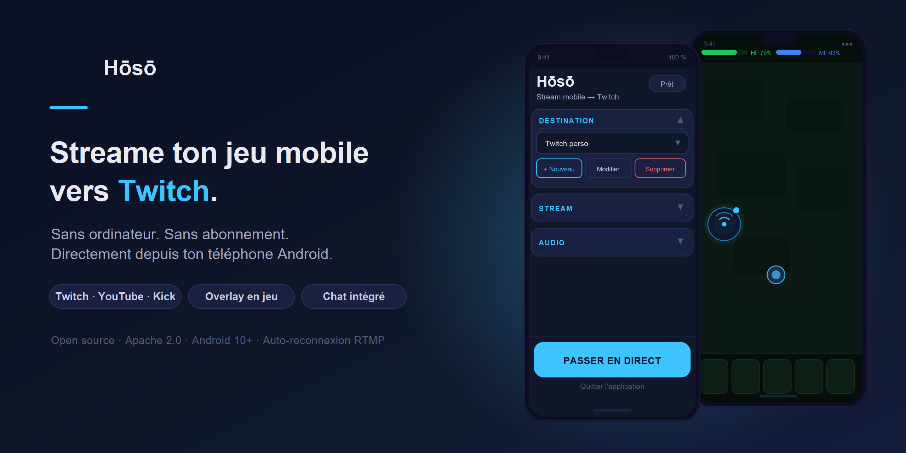
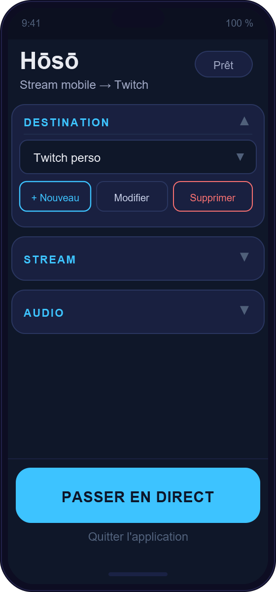
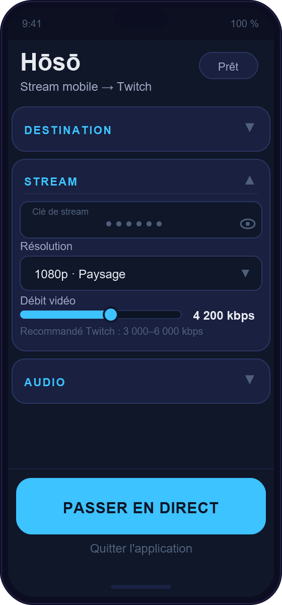
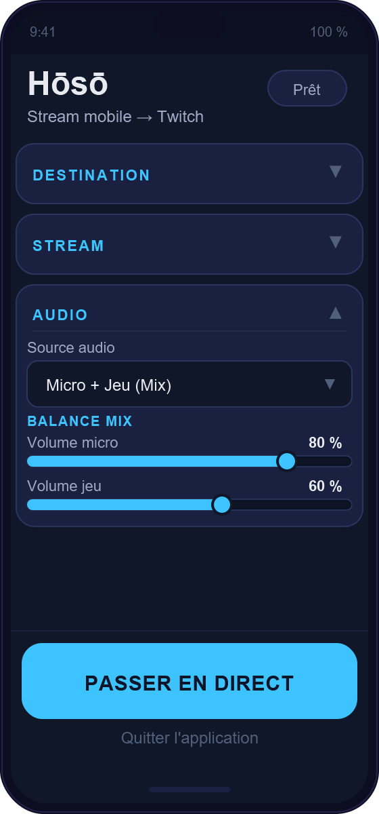
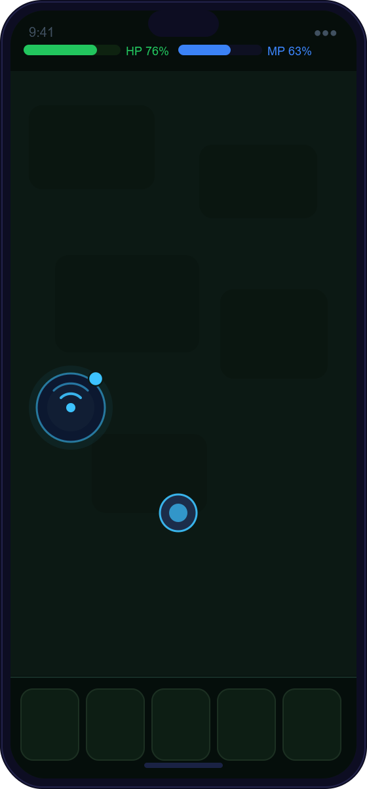
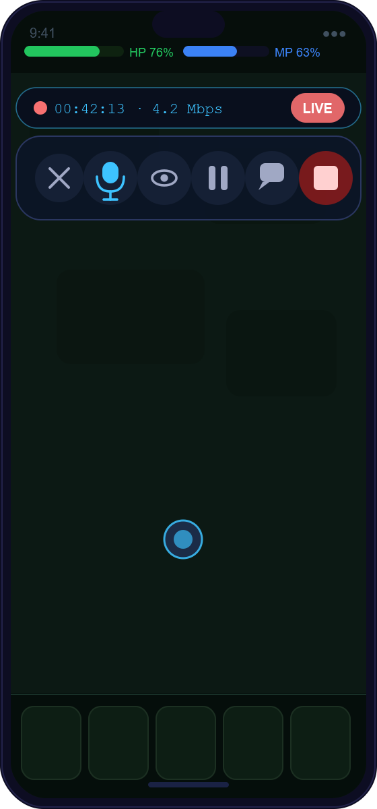
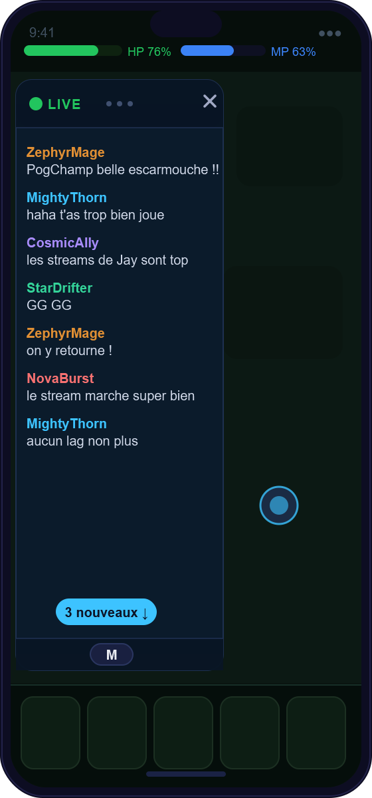
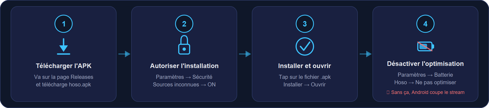

<div align="center">



# Hōsō · 放送

**Streame ton jeu mobile vers Twitch. Directement depuis ton téléphone. Sans ordinateur.**

[](LICENSE)
[](https://developer.android.com)
[](../../releases)

</div>

---

## 📱 À quoi ça ressemble

<table align="center">
  <tr>
    <td align="center">
      
      <br/><sub><b>Configuration</b><br/>4 sections repliables</sub>
    </td>
    <td align="center">
      
      <br/><sub><b>Réglages stream</b><br/>Résolution, bitrate, clé de stream</sub>
    </td>
    <td align="center">
      
      <br/><sub><b>Mode Mix audio</b><br/>Micro + son du jeu, balance indépendante</sub>
    </td>
  </tr>
  <tr>
    <td align="center">
      
      <br/><sub><b>En jeu — discret</b><br/>Bulle draggable, toujours accessible</sub>
    </td>
    <td align="center">
      
      <br/><sub><b>Contrôles live</b><br/>HUD + actions en un tap</sub>
    </td>
    <td align="center">
      
      <br/><sub><b>Chat Twitch</b><br/>Flottant, redimensionnable, sans bloquer le jeu</sub>
    </td>
  </tr>
</table>

---

## C'est quoi Hōsō ?

Hōsō (放送 — « diffusion » en japonais) est une app Android qui fait **une chose et la fait bien** : capturer ton écran de jeu et le diffuser en direct sur Twitch, YouTube Live, Kick ou n'importe quel serveur RTMP.

**Pourquoi Hōsō plutôt que Streamlabs Mobile ou Prism Live Studio ?**

Ces apps plantent sur certains téléphones Android 10+ parce qu'elles gèrent mal les services en arrière-plan. Hōsō s'appuie sur un `foreground service` natif — c'est exactement ce qui manque aux concurrents, et c'est le cœur de l'app.

**Ce que tu gardes pendant que tu joues :**
- Une petite **bulle draggable** reste visible sur ton jeu
- Depuis cette bulle : arrêter le stream, couper le micro, afficher le chat Twitch — sans jamais quitter le jeu

---

## 📥 Installer l'app (sans passer par le code)

> Hōsō n'est pas sur le Play Store. Elle se télécharge comme un fichier APK — c'est simple, 4 étapes.

<div align="center"></div>

### Étape 1 — Télécharge l'APK

Va sur la page **[Releases ↗](../../releases)** et télécharge le fichier qui se termine par **`.apk`** (par ex. `hoso-v0.1.0.apk`).

### Étape 2 — Autorise les sources inconnues

Android bloque les apps hors Play Store par défaut. Pour lever ce blocage :

1. Ouvre **Paramètres** → **Sécurité** (ou **Applications** selon ton téléphone)
2. Active **"Installer des sources inconnues"** pour ton navigateur ou gestionnaire de fichiers
3. Sur certains modèles (Xiaomi, Samsung), la demande d'autorisation s'affiche automatiquement quand tu tappes sur l'APK

### Étape 3 — Installe et lance

Ouvre le fichier APK téléchargé → **Installer** → **Ouvrir**.

### ⚠️ Étape 4 — Optimisation batterie (important)

Sans cette étape, Android peut couper le stream au bout de quelques minutes.

**Procédure générale :**
1. **Paramètres** → **Batterie** → **Optimisation de la batterie**
2. Cherche « Hōsō » → sélectionne **Ne pas optimiser**

> 📖 Certains constructeurs (Xiaomi, Oppo, Samsung) ont des menus spécifiques.
> Guide complet par marque : [docs/Battery-Optimization-Guide.md](docs/Battery-Optimization-Guide.md)

---

## ❓ Questions fréquentes

**C'est gratuit ?**  
Oui, complètement. Hōsō est open source (Apache 2.0) — le code est entièrement visible sur ce dépôt.

**Pourquoi ce n'est pas sur le Play Store ?**  
Le Play Store impose des règles strictes sur les apps de capture d'écran. Hōsō est publiée directement par le développeur — l'installation APK prend 4 étapes (guide ci-dessus) et ne présente aucun risque particulier.

**L'APK est sûr ?**  
Le code source complet est visible ici. Hōsō ne collecte aucune donnée et ne fait aucun appel réseau sauf vers la destination de stream que tu configures toi-même. La signature de chaque release est vérifiable via `apksigner`.

**Ça marche sur mon téléphone ?**  
Android 10 et supérieur (la grande majorité des téléphones depuis 2019). Testé sur Samsung, Xiaomi, OnePlus et Pixel. Note : certains jeux bloquent la capture audio système — dans ce cas Hōsō fonctionne quand même en mode Micro seul.

**Le stream s'arrête si je change d'app ou reçois un appel ?**  
Non. Hōsō tourne en arrière-plan via un service natif Android — il n'est pas coupé quand tu changes d'app. Si ton réseau coupe (4G/5G instable), l'auto-reconnexion tente jusqu'à 20 fois sur ~8 minutes sans que tu aies à intervenir.

---

## ✨ Fonctionnalités

### 🎯 Destinations configurables
Crée autant de profils de destination que tu veux : **Twitch**, **YouTube Live**, **Kick**, ou n'importe quelle URL RTMP custom. Change de cible en un seul tap depuis l'écran principal — utile si tu streames sur plusieurs plateformes ou avec plusieurs comptes.

### 📡 Stream robuste
- **Résolution** : 1080p natif, 720p, 480p, modes recadrage portrait/paysage
- **Bitrate** : de 1 000 à 8 000 kbps, réglable précisément (Twitch recommande 3 000–6 000 kbps)
- **Encodage CBR H.264** via le codec hardware du téléphone — léger sur la batterie
- **Auto-reconnexion** : si le réseau coupe (4G/5G fluctuant), Hōsō se reconnecte automatiquement jusqu'à 20 fois sur ~8 minutes, sans que tu aies à toucher quoi que ce soit

### 🎙 Audio flexible

**Mode Micro** — capture uniquement ta voix pour commenter la partie.

**Mode Mix** — capture le micro ET le son du jeu en simultané, avec deux curseurs de volume indépendants. Tu règles la balance micro/jeu depuis l'écran de config ou depuis la bulle overlay pendant le stream.

> Note : certains jeux bloquent la capture audio système (`AudioPlaybackCapture`). Si le tien est concerné, Hōsō fonctionne quand même en mode Micro seul.

### 🫧 Overlay flottant

Une bulle discrète reste en permanence sur ton écran pendant que tu joues. Elle est **draggable** — mets-la là où elle ne gêne pas.

**Un tap** sur la bulle ouvre le panneau de contrôles :

| Bouton | Action |
|--------|--------|
| **×** | Referme le panneau (le stream continue) |
| **Mic** | Mute/unmute le micro en direct |
| **Œil** | Mode confidentialité — masque l'écran et coupe le son |
| **Pause** | Pause le stream (masque + son coupé) |
| **Chat** | Affiche/masque la bulle de chat Twitch |
| **■ Stop** | Arrête le stream définitivement |

Un **HUD** s'affiche au-dessus des boutons quand le stream est actif : durée, bitrate sortant, état de connexion, état du micro.

Le panneau se referme automatiquement après 5 secondes d'inactivité pour ne pas gêner le jeu.

### 💬 Chat Twitch intégré

Le chat de ta chaîne s'affiche dans une **fenêtre flottante** positionnable n'importe où sur l'écran. Trois tailles disponibles (S/M/L, tap en bas de la bulle pour changer). Le jeu en dessous reste entièrement jouable — les touches du chat ne bloquent pas tes inputs.

Status visible dans l'en-tête : `LIVE` (connecté), `…` (connexion en cours), `OFF` (arrêté).

---

## 🛠 Pour les développeurs

### Stack

| Composant | Technologie |
|-----------|-------------|
| Langage | Kotlin |
| SDK minimum | Android 10 (API 29) |
| SDK cible | Android 15 (API 35) |
| Streaming | [StreamPack 3.1.2](https://github.com/ThibaultBee/StreamPack) — fork local (fix race condition audio Twitch) |
| Build | Gradle 8.13 · AGP 8.13.1 |
| UI | Material Components 2 + ViewBinding |
| Chat | Client Twitch IRC maison (zéro dépendance externe) |

### Architecture

```
MainActivity (écran de configuration)
  └── OverlayService (foreground — bulle flottante draggable)
       ├── StreamPermissionActivity (demande MediaProjection, transparent)
       │    └── ScreenRecordService (foreground — capture écran + RTMP)
       └── ChatBubbleService (foreground — IRC Twitch, 3 fenêtres overlay)
            ├── Body window   (FLAG_NOT_TOUCHABLE — visuel seul)
            ├── Header overlay (drag, fermeture, opacité)
            └── Dot overlay   (cycle taille S/M/L)
```

### Fork StreamPack

Hōsō utilise un composite build local de StreamPack avec un correctif pour une race condition où le header AAC (`csd-0`) était émis avant que le handshake RTMP soit terminé — ce qui faisait que Twitch ne recevait jamais les infos du codec audio.

- Fork : `streampack-fork/` (gitignored, dépôt séparé)
- Upstream PR : [ThibaultBee/StreamPack#294](https://github.com/ThibaultBee/StreamPack/pull/294)

### Build (debug)

```bash
# Requiert Android Studio JBR ou JDK 17+
export JAVA_HOME="/path/to/android-studio/jbr"

# Cloner le fork StreamPack à côté :
git clone https://github.com/theermite/StreamPack streampack-fork
cd streampack-fork && git checkout fix/twitch-audio-race-hoso && cd ..

./gradlew assembleDebug
```

```bash
# Installer sur le device connecté en USB :
adb install -r app/build/outputs/apk/debug/app-debug.apk
```

### Build signé (release)

Les APKs de release sont signés avec une clé stockée dans [Shinkofa-Vault](https://github.com/theermite/Shinkofa-Vault) (SOPS + age). Les contributeurs externes n'en ont pas besoin — `assembleDebug` est suffisant pour le développement et les PRs.

Pour le mainteneur (avec accès `age` au Vault) :

```bash
# Récupère le keystore + mots de passe depuis le Vault VPS.
# Cible : ~/.android-keystores/hoso-release.jks + ./local.properties
./scripts/fetch-signing.sh

# Build APK de release signé :
./gradlew assembleRelease
# → app/build/outputs/apk/release/app-release.apk
```

---

## 🗺 Roadmap

Voir [docs/Roadmap.md](docs/Roadmap.md) pour le plan de features complet avec statuts.

**Prochaines features :** Emotes et badges dans le chat Twitch, CI GitHub Actions, distribution IzzyOnDroid / F-Droid.

---

## 🤝 Contribuer

Issues et pull requests bienvenus. Hōsō est construit autour d'un stack volontairement réduit — ouvre une issue pour discuter des changements substantiels avant d'envoyer une PR.

Conventions :
- Commits atomiques, messages en anglais (style conventionnel)
- Tests sur les chemins critiques côté JVM (`StreamConfig`, parsers, état overlay)
- Un commit par feature minimum

---

## 📄 Licence

Hōsō est distribué sous la [licence Apache 2.0](LICENSE).
Les attributions de composants tiers sont listées dans [NOTICE](NOTICE).

---

## Auteur

**[The Ermite](https://solo.to/theermite)** — streamer, builder, IRL gaming.
